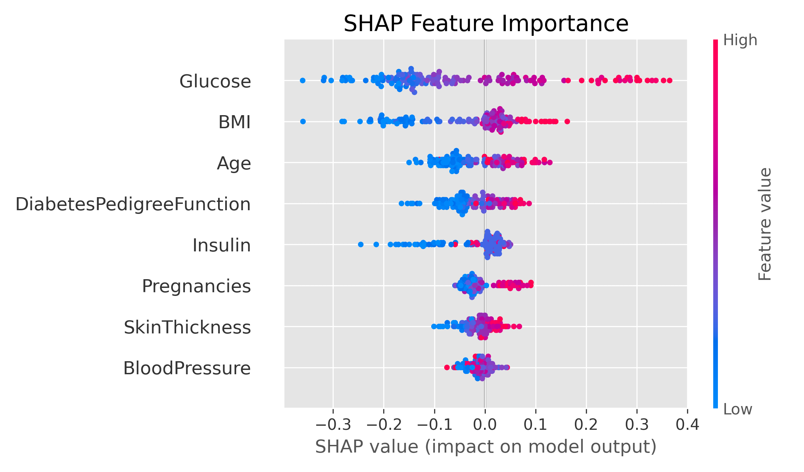
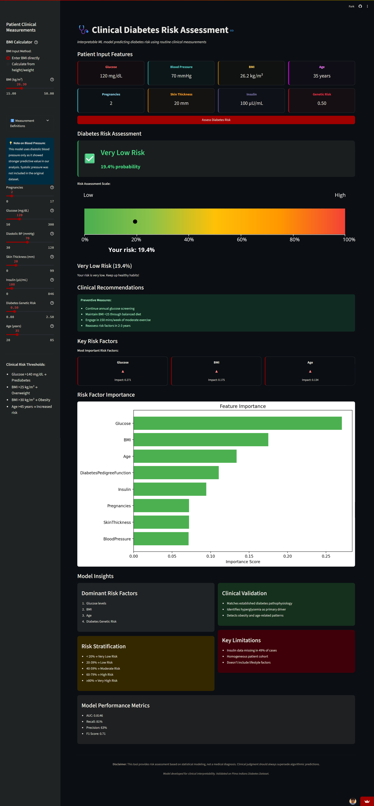
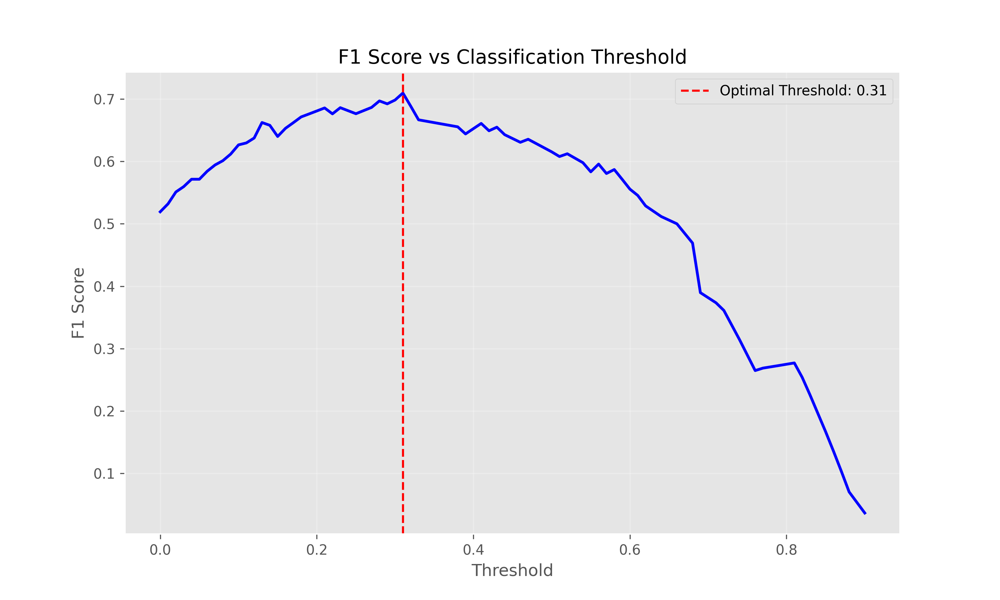
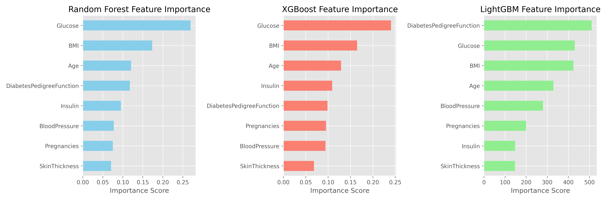
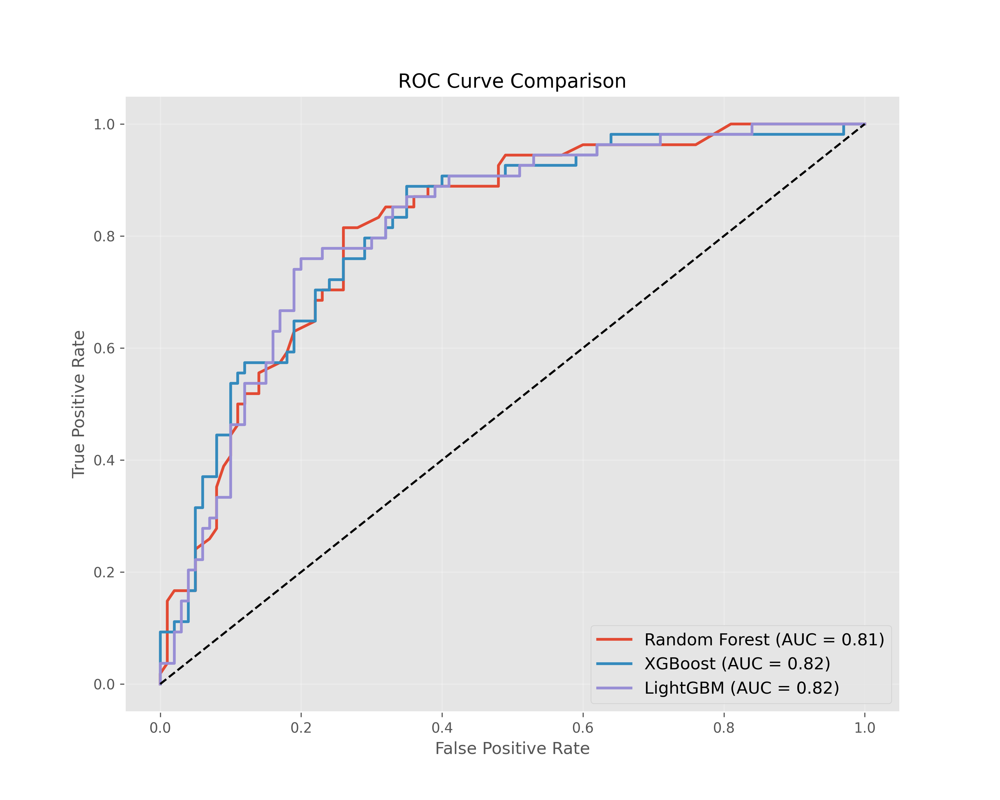

# GlucoSense Clinical

[](https://harsh782patel-clinical-diabete-diabetes-streamlit-appapp-d8l0bl.streamlit.app/)

  
*Example of model interpretability using SHAP values*

## Overview
This project provides a modern, interactive web dashboard for predicting diabetes risk based on clinical measurements from the Pima Indians Diabetes dataset. It originally used a Streamlit frontend with Random Forest, but has been upgraded to use a **LightGBM** machine learning model served via **FastAPI**, with a stunning, highly-interactive frontend built in **Next.js**. 

The solution focuses on interpretability and clinical relevance, providing not just predictions but also explanations for each prediction to support medical decision-making.

**Key Features**:
- **Modern Next.js Web Dashboard**: Highly interactive, beautifully designed UI for clinical data entry.
- **FastAPI Backend**: A lightning-fast Python API to serve the trained LightGBM model.
- **LightGBM Predictive Engine**: High-performance gradient boosting model trained on 8 clinical features.
- **Interpretable AI**: SHAP values for prediction explanations (supported in the notebook).
- **Medical-Grade Risk Visualization**: 5-level animated risk gauge reflecting exact model probabilities.
- **Integrated BMI Calculator**: Built-in tool for effortless body mass index computation.
- **Clinical Definitions**: Hoverable tooltips explaining each medical parameter in plain English.
- **Personalized Recommendations**: Actionable medical guidance mapped to the user's specific risk tier.

## Architecture

1. **Frontend (`ui/`)**: A React application built with **Next.js** and styled with Tailwind CSS. It provides the interactive dashboard, form validation, BMI calculator, and risk visualization.
2. **Backend (`api/main.py`)**: A **FastAPI** service that exposes a REST endpoint (`/predict`). It receives patient data, formats it into a Pandas DataFrame, and passes it to the ML model.
3. **Machine Learning (`train_rf.py`)**: A Python pipeline using `scikit-learn` to impute missing values, scale features, and train a Random Forest classifier, exporting the result to `api/clinical_diabetes_rf_pipeline.pkl` and `api/feature_names.pkl`.

## Installation & Setup

1. **Clone the repository**:
```bash
git clone https://github.com/yassineglx/diabete_risk.git
cd diabete_risk
```

2. **Set up the Python Environment (Backend)**:
```bash
python -m venv venv
venv\Scripts\activate  # On Windows
pip install -r requirements.txt
pip install fastapi uvicorn pydantic lightgbm scikit-learn pandas
```

3. **Install Node.js Dependencies (Frontend)**:
```bash
cd ui
npm install
cd ..
```

## Usage

### 1. Training the Model
If you need to retrain the LightGBM model on new data:
```bash
venv\Scripts\python train_lgbm.py
```
This will generate `api/clinical_diabetes_pipeline.pkl` and `api/feature_names.pkl`.

### 2. Running the Application
Use the provided batch script to launch both the FastAPI backend and Next.js frontend concurrently:

```bash
.\start_dashboard.bat
```

Alternatively, you can run them manually in separate terminal windows:
- **Backend**: `venv\Scripts\python -m uvicorn api.main:app --host 127.0.0.1 --port 8000 --reload`
- **Frontend**: `cd ui && npm run dev`

The dashboard will be accessible at [http://localhost:3000](http://localhost:3000).

## Model Details
The system utilizes a **LightGBM Classifier** wrapped in a `scikit-learn` pipeline.
- **Imputation**: Missing values are replaced using median imputation.
- **Scaling**: Standard scaling is applied to normalize feature distributions.
- **Features Used**: Pregnancies, Glucose, Blood Pressure, Skin Thickness, Insulin, BMI, Diabetes Pedigree Function, Age.

## Key Results
### Web Application Features
 
*Clinical dashboard with input parameters, risk visualization, recommendations*

### Model Performance Comparison
| Model          | ROC-AUC | Accuracy | Precision | Recall |
|----------------|---------|----------|-----------|--------|
| **LightGBM**   | 0.82    | 0.77     | 0.75      | 0.65   |
| **XGBoost**    | 0.85    | 0.79     | 0.76      | 0.78   |
| Random Forest  | 0.83    | 0.79     | 0.74      | 0.75   |

*Note: While LightGBM and XGBoost offer competitive performance, LightGBM is now deployed as the primary API engine due to its execution speed and flexibility with the FastAPI backend integration.*

### Optimal Decision Threshold
  
*Optimal decision threshold at 0.31 balances precision (0.63) and recall (0.81)*

### Feature Importance
  
*Glucose levels, BMI, and Age are the strongest predictors of diabetes risk*

### ROC Curve Comparison
  
*XGBoost and LightGBM show highly competitive predictive capability against the Random Forest baseline*

## Contributing
Contributions are welcome! Please follow these steps:
1. Fork the project
2. Create your feature branch (`git checkout -b feature/AmazingFeature`)
3. Commit your changes (`git commit -m 'Add some AmazingFeature'`)
4. Push to the branch (`git push origin feature/AmazingFeature`)
5. Open a Pull Request

## License
Distributed under the MIT License. See `LICENSE` for more information.
